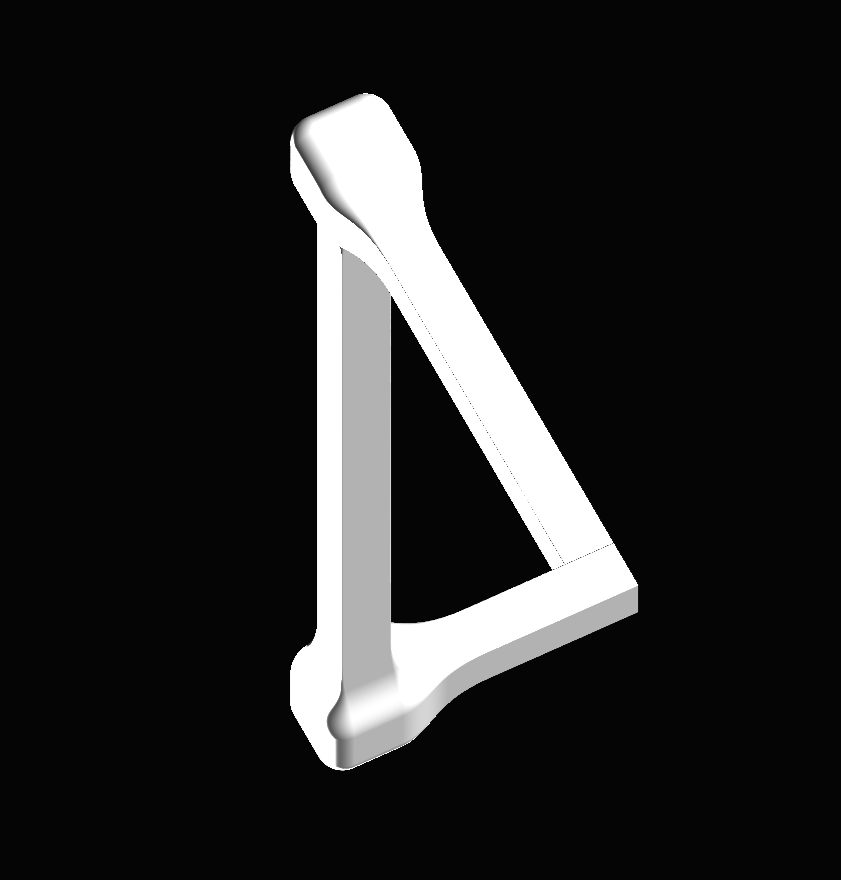

Interactive 3D Penrose Triangle

The Interactive 3D Penrose Triangle is a real-time rendering of the famous "impossible triangle," brought to life in 3D. Unlike traditional illusions, this project allows you to explore the Penrose triangle dynamically from all angles, maintaining its seamless, impossible appearance.

Features:

Dynamic Perspective: Fully interactive and rotatable 3D visualization of the Penrose triangle.

Real-Time Rendering: Powered by GLSL shaders and GPU acceleration for smooth performance.

Advanced Blending: Uses smooth minimum functions to create seamless transitions between rods.

Lighting Effects: Includes diffuse, ambient, and specular lighting for realistic shading.

Requirements:

Python 3.12.3 or later
Dependencies listed in requirements.txt

Usage:

Download or clone the repository.
Install the dependencies (see requirements.txt).
Run the script _3D_Penrose_Triangle.py.

Controls:

Mouse: Rotate the camera to explore the illusion.
Enjoy discovering the magic of an impossible object made real in 3D!
